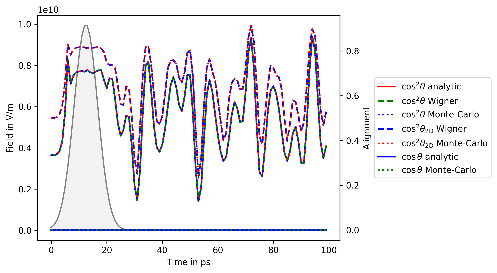

Here we provide examples of calculations of the rotational density and the expectation
values of operators using the Monte-Carlo sampling approach.

Content
-------

* [ocs_alignment.py](ocs_alignment.py) - simulation of laser-induced 1D alignment of OCS,
  including calculations of rotational density
* [dens_sampling.py](dens_sampling.py) - calculation of expectation values of alignment functions
  using the rotational density (produced, e.g. in [ocs_alignment.py](ocs_alignment.py))

The comparison of time-dependent alignment (and 'zero' orientation) of OCS calculated analytically
and using Monte-Carlo sampling with rotational density,
produced by [dens_sampling.py](dens_sampling.py): 
